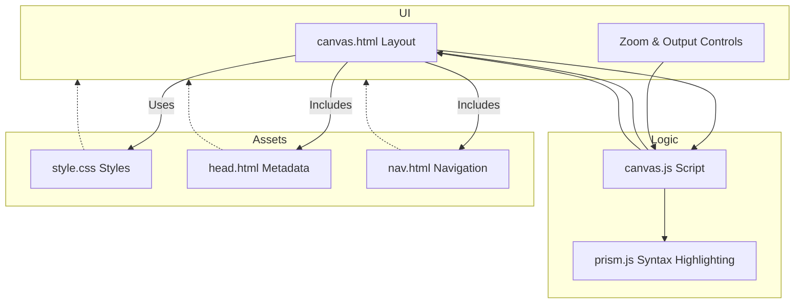

## Visualizing JSON Canvas System Architecture

Understanding how JSON Canvas delivers its open, extensible infinite canvas experience starts with its well-organized system architecture. This page reveals the core components powering the application — from the user interface where your canvases come to life, to the logic managing nodes and edges, and the assets and layouts working behind the scenes. By exploring their interactions through a visual diagram and concise explanations, you will grasp how JSON Canvas transforms static JSON data into dynamic, interactive canvases you can manipulate effortlessly.

## Defining the Architecture and Its Audience

JSON Canvas’s architecture is designed to manage spatial, interconnected data seamlessly within a browser environment. It separates responsibilities into distinct core components: the HTML layout serving as the container for nodes and edges; JavaScript code providing user interaction, rendering, and canvas state management; static assets such as stylesheets defining the visual theme; and supporting files like navigation and headers to embed contextual information.

This architecture’s primary audience includes developers, integrators, and advanced users who want to understand how JSON Canvas operates under the hood. Whether looking to customize the interface, extend functionality, or debug interactions, this breakdown offers the foundational knowledge needed to navigate the system confidently.

## How JSON Canvas Components Collaborate

At its heart, the system revolves around the canvas HTML layout which hosts individual "nodes" and "edges" represented visually and spatially. User interactions such as dragging, zooming, and panning are managed by a supporting JavaScript module that dynamically updates node positions, redraws edges as SVG paths, and maintains consistent canvas scale and pan offsets.

Static CSS assets define the theming and ensure visual clarity, responsiveness, and accessibility across different devices. Navigation and header components provide consistent branding and links, enhancing the user’s ability to explore related resources.

The diagram below captures this interplay, illustrating the flow from UI components through logic handlers to the output representation.



## Anatomy of JSON Canvas in Action

When you open JSON Canvas, the HTML layout (`canvas.html`) creates a container that organizes nodes — files, text blocks, images — and edges which visually link those nodes. Each node's position, type, and associated data are rendered with individual HTML elements styled by CSS. The JavaScript (`canvas.js`) manages state and user interaction smoothly — it listens for drag events to move nodes, applies zoom scaling (both mouse wheel and control buttons), and updates connecting edges to remain visually attached.

Consider dragging a node representing a `.md` file; the system recalculates its new position, redraws connecting edges in real-time, and updates a JSON output pane reflecting the current canvas state. This live feedback enables users to organize complex visual data intuitively, knowing the serialized JSON will match their layout.

A practical example of the edge drawing logic looks like this:

```javascript
// Computes bezier curves for edges connecting nodes
function drawEdges() {
  // For each edge, calculate from/to anchor points
  // Create SVG path with a smooth curve
}
```

This interaction demonstrates the tight coupling between presentation and logic, enabling a dynamic infinite canvas experience.

## Previewing Setup and Next Steps

Getting started involves loading the `canvas.html` in a compatible browser, which brings together all components and activates the JavaScript logic. From there, exploring node manipulation, zoom controls, and toggling output serialization enables immediate hands-on understanding.

For detailed steps on setting up JSON Canvas and creating your own canvases, visit the [Getting Started Guide](/getting-started/quick-setup-journey/installation-and-first-launch) and explore core workflows such as [Creating Your First Canvas](/guides/core-workflows/creating-your-first-canvas).

Understanding this architecture equips you to customize, debug, or extend JSON Canvas confidently, unlocking its full potential as a flexible, user-driven infinite canvas platform.

<Source url="https://github.com/obsidianmd/jsoncanvas" paths={[{"path": "assets/canvas.js", "range": "1-219"},{"path": ".layouts/canvas.html", "range": "1-93"}]} branch="main" />
